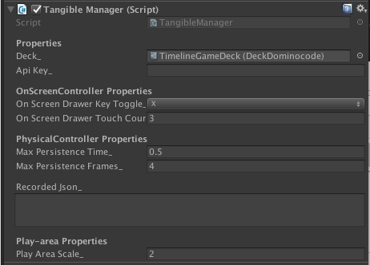

# API

## API Key

You should have received a private API Key along with your Osmo SDK download. This uniquely identifies you and should not be shared publicly.

It should look like this: `01234567-89AB-CDEF-0123-456789ABCDEF`

If you don't have an API Key, contact us through [this application](https://docs.google.com/forms/d/1131Box1LDAskOu2tg5C0zak4G8Wp_WhpONpw73VH1aU/viewform?ts=5a0b256f)

You have two options on how to enter this API Key in your Unity project.

You can paste it directly into `Assets/Plugins/ApiKey.cs`
```csharp
namespace Tangible.SDK.Vision {
	public static class API {
		public static string Key = "00000000-0000-0000-0000-000000000000";
	}
}
```

You can set it in the inspector in your `TangibleManager`. Values set in the inspector will take precedence over values set in `ApiKey.cs`.


## TangibleManager
- [TangibleManager.AliveObjects](#aliveobjects)
- [TangibleManager.OnObjectEnter](#onobjectenter)
- [TangibleManager.OnObjectExit](#onobjectexit)
- [TangibleManager.OnUpdatedTangibleObjects](#onupdatedtangibleobjects)
- [TangibleManager.Mute](#mute)

`TangibleManager` is the main interface to the OsmoSDK. You can access all the `TangibleObject`s here which represent the physical pieces.

The class implements multiple ways of generating the input, primarily:
  - If the game is running in the Unity Editor, it will use the `OnScreenController` which simulates pieces.
  - Otherwise, it will use the `PhysicalController` which relies on the `VisionFramework` and the camera input.



### AliveObjects
```csharp
public IEnumerable<TangibleObject> AliveObjects { get; }
```

All `TangibleObject`s that are `Alive`. This is useful if you are starting up some level and want to know if vision already has some recognized pieces.


### OnObjectEnter
```csharp
public event Action<TangibleObject> OnObjectEnter;
```

Invoked whenever a `TangibleObject` becomes `Alive`. This is the case when the piece (whether simulated or not) is recognized from vision.

### OnObjectExit
```csharp
public event Action<TangibleObject> OnObjectExit;
```

Invoked whenever a `TangibleObject` becomes not `Alive`. This happens when the piece is no longer recognized by vision and after a certain amount of time / frames have passed. You can modify how long this takes by changing the values on your `TangibleManager` MonoBehaviour on your scene.

The `TangibleObject` persists because the piece can disappear from vision for a couple frames due to any number of factors including obstruction from hands, etc.

### OnUpdatedTangibleObjects
```csharp
public event Action OnUpdatedTangibleObjects;
```

Invoked whenever the `VisionFramework` has processed and returned new data. The `VisionFramework` does NOT run in lockstep with Unity, it is completely asynchronous.

It will generally run at approximately 10-20 frames per second, but on older devices it may be even slower (especially if you are doing a lot of CPU processing in Unity).


### Mute
```csharp
public void Mute(bool mute);
```

Muting the `VisionFramework` will disable all computer vision processing until you unmute. This is useful if you want to save CPU resources when you don't need any data from the `VisionFramework` (such as if you're on a home screen or a settings screen).


## TangibleObject
- [TangibleObject.Id](#id)
- [TangibleObject.UniqueId](#uniqueid)
- [TangibleObject.Alive](#alive)
- [TangibleObject.Visible](#visible)
- [TangibleObject.Location](#location)

`TangibleObject` is the C# class that represents a physical piece in the Deck.

### Id
```csharp
public int Id;
```

`Id` is mapped to a piece in the Deck (this is non-unique since there can be multiples of the same piece - i.e. walking block in Coding)

### UniqueId
```csharp
public readonly int UniqueId;
```

Given that there can be multiple of the same pieces per deck, `TangibleObject`s have a `UniqueId` which is used to map the vision output to the last closest unique physical piece.

This is a best effort calculation. You will never see two objects with the same `UniqueId`, but you may see see two `UniqueId`s where you would have thought there should have been one (generally worse on older iPads with worse cameras where we cannot keep track of tiles as well).

### Alive
```csharp
public bool Alive { get; }
```

`Alive` means that this piece is in the play area. This includes persisted pieces that were not in the last vision frame.

### Visible
```csharp
public bool Visible { get; }
```

`Visible` means that this piece is in the play area. This **does not** includes persisted pieces that were not in the last vision frame. `Visible` values will flicker on/off as the vision algorithms work with imperfect camera input.

### Location
```csharp
public Location Location { get; }
```

`Location` contains all the data of the piece's current position and orientation.

Note: The Orientation value for the basic tiles (words and numbers) are not particularly stable. If you need orientation you will want to use Coding or domino codes which will give you much cleaner values.

```csharp
public class Location {
  public float X { get; }
  public float Y { get; }

  // angle in degrees
  public float Orientation { get; }
}
```

## TangibleDebugOverlay
- [TangibleDebugOverlay.Show](#show)
- [TangibleDebugOverlay.Hide](#hide)

To debug what the vision is seeing on device, we have provided a class called `TangibleDebugOverlay` which has two methods `Show()` and `Hide()`. You can show the debug overlay at anytime to display ghost tiles on the screen matching the `TangibleObject`s active in `TangibleManager`.

You can toggle the TangibleDebugOverlay through the editor panel that appears when you press 'S'. Use the "Debug Overlay" checkmark at the bottom. You'll see the raw id values overlayed on top of the tiles you are manipulating.


### Show
```csharp
public static void Show();
```

`Show` starts up DebugOverlay objects which will render ghost pieces on the screen that correspond to `TangibleObject`s in `TangibleManager`.

### Hide
```csharp
public static void Hide();
```

Hides the DebugOverlay objects.
