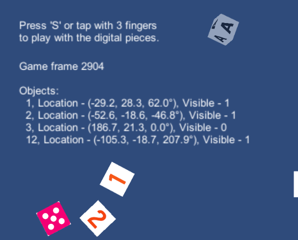
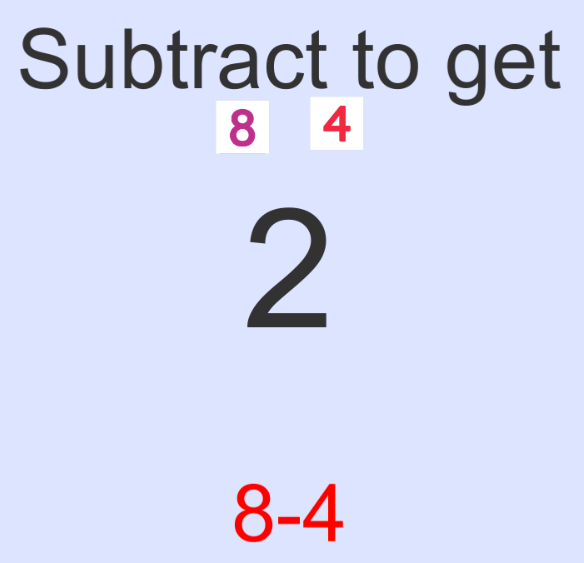
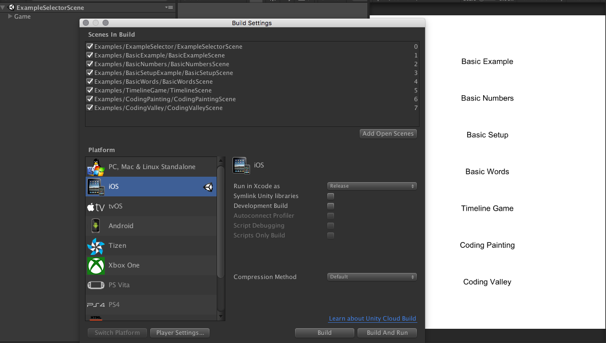

# Examples

We provide a set of example scenes which demonstrate various ways to use the SDK. These range from simply dumping out raw data to a small puzzle game using Coding tiles. Explore, mangle, and poke at these to your heart's content.

## 1. Basic Example
`Examples/BasicExample/BasicExampleScene.unity`

A simple example of dumping out values seen by the computer vision to screen. Swap out the Deck of the `TangibleManager` on the scene to use different types of tiles.

In our `Update()` call of `Tangible.SDKExamples.BasicExample.Game` you will see we use the current `AliveObjects` list pulled from the singleton instance of `TangibleManager`.

## 2. Basic Setup Example
`Examples/BasicNumbers/BasicNumbersScene.unity`

An example of how to use the setup configuration values in order to instruct the user on how to properly set up the Osmo hardware.

If you are testing this in the editor, look at the `VisionSetup` object in the scene. You can modify which flags are sent (see the [`VisionSetup`](#visionsetup) section for more).

## 3. Basic Numbers
`Examples/BasicSetupExample/BasicSetupScene.unity`

In this example, we subscribe to the events `OnObjectEnter` and `OnObjectExit` from the `TangibleManager`. In the case of subtraction, we also register for the event `OnLocationChanged` because we need to order by X position when tiles move (even if no new tiles enter or exit the play area)

## 4. Basic Words
`Examples/BasicWords/BasicWordsScene.unity`

An example of a game which only registers with `OnObjectEnter`. Once a letter has been detected, the game treats it as guessed. `OnObjectExit` is ignored because letters cannot be unguessed.

## 5. Timeline Game
`Examples/TimelineGame/TimelineScene.unity`

An example game using domino codes. It uses a custom deck (which ignores domino code values that are not used by the game). To play this on device, print out a set of domino codes from `dominocodes.pdf` in the `Readme` directory of the SDK.

In order to make your own custom decks, see the [Customizing Deck](#customizing-decks) section.

## 6. Coding Painting
`Examples/CodingPainting/CodingPaintingScene.unity`

See the [Testing In-Editor](#testing-in-editor) section for how to play in-editor with Coding tiles.

The game of life, using coding tiles to seed different species on the board.

This game uses Coding tiles, and the `ClusterManager`. It uses the most simple decision of what cluster to use by always choosing the largest one.

The `ClusterManager` subscribes to the `OnUpdatedTangibleObjects` event which fires an event every time the computer vision returns with a new set of data. The rate at which this happens is not the same as your Unity update rate. It’s generally 10-20 times per second on a newer iPad.

See `CodingClusterService` for how the game decides what is in a cluster and what is not.

## 7. Coding Valley
`Examples/CodingValley/CodingValleyScene.unity`

See the [Testing In-Editor](#testing-in-editor) section for how to play in-editor with Coding tiles.

An example of a more complete small puzzle game using the Coding tiles.

## 8. Perspective Transform
`Examples/PerspectiveTransformExample/PerspectiveTransformExampleScene.unity`

Shows how to use the perspective transform only mode. This converts the input camera image into a unwarped top-down simulated view.

This can be useful if you are planning on running your own custom Computer Vision algorithms. If you intend to use this mode, please contact us as the example given is only intended for very basic prototyping.

## 9. Example Selector
`Examples/ExampleSelector/ExampleSelectorScene.unity`

Use this scene if you want to select between the above example scenes. We do not currently support swapping decks at runtime (please let us know if you would like this feature), so you will have to close the app to select a new scene.

In order to have this work, you will need to add all of the scenes in your `File -> Build Settings -> Scenes in Build` list.

