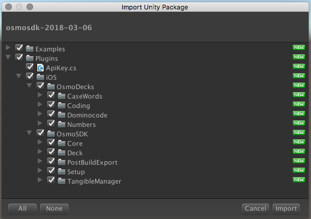
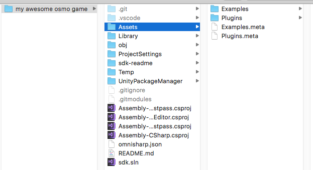
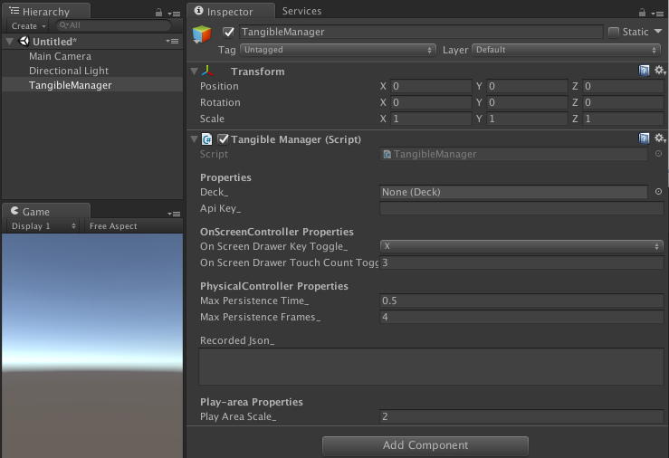
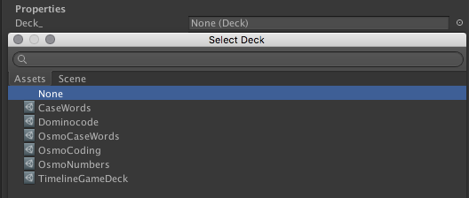
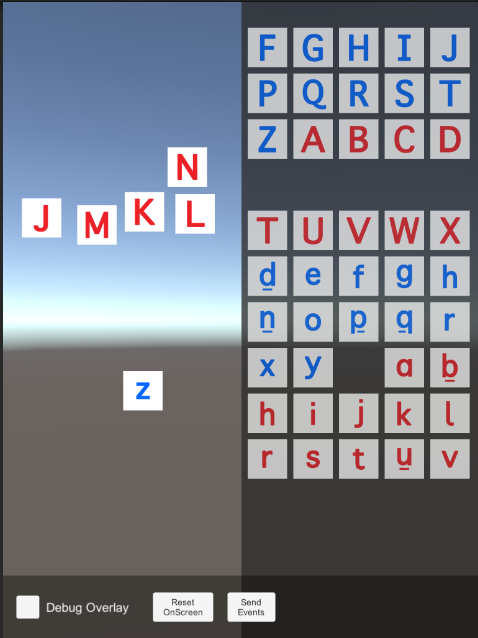
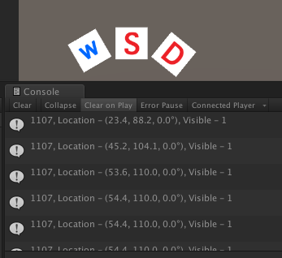
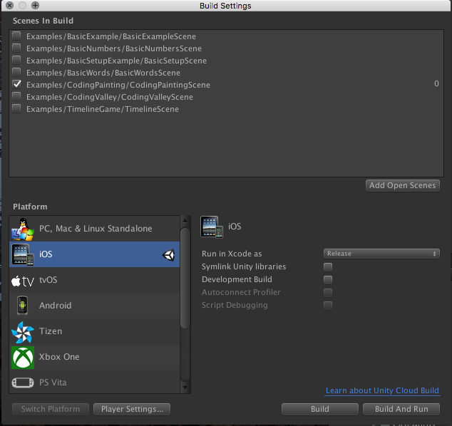
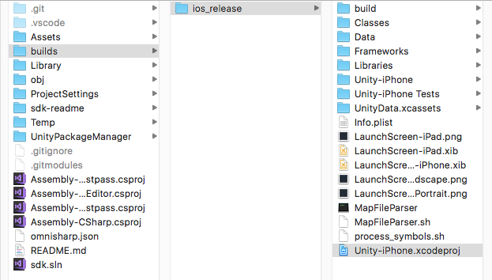
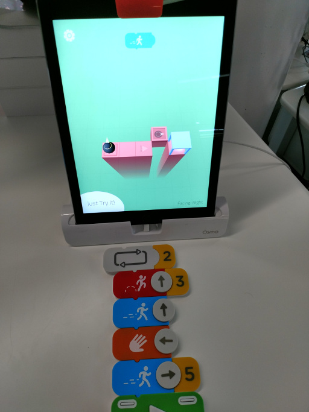

# Quick-start Guide

## What you'll need
+ This guide (view the latest version [online](https://sdk.playosmo.com))
+ Unity (tested against `2017.4.X`)
+ XCode (tested against `9.X`, `10.X`)
+ MacOS (tested against Sierra, High Sierra, Mojave)
+ An iPad (any iPad [Osmo supports](https://support.playosmo.com/hc/en-us/articles/115009542208-Which-iPad-models-is-Osmo-compatible-with-) - with iOS 8+)
 - Amazon Fire SDK support is being looked into, email us if you are interested
+ Osmo Hardware ([Base+Reflector](https://www.playosmo.com/en/shopping/?overlay=osmo_game_system+osmo_base_ipad) and tiles you want to use from the set: [Words](https://www.playosmo.com/en/words/), [Numbers](https://www.playosmo.com/en/numbers/), [Coding Awbie](https://www.playosmo.com/en/coding/), [Coding Jam](https://www.playosmo.com/en/coding-jam/), [Domino Codes](https://github.com/tangibleplay/sdk-readme/blob/master/dominocodes.pdf))
+ The Osmo SDK binaries (you should have received a download link to a `unitypackage` + `zip`)
+ An Osmo API Key (it should look like this `01234567-89AB-CDEF-0123-456789ABCDEF`)
	- If you don't have an API Key, contact us through [this application](https://docs.google.com/forms/d/1131Box1LDAskOu2tg5C0zak4G8Wp_WhpONpw73VH1aU/viewform?ts=5a0b256f)

## Getting started with a 'Hello World' app
1. Download the `osmosdk-<date>.unitypackage` or `osmosdk-<date>.zip` file you were linked to.
	- They both have the exact same SDK and Examples in them, use whichever you're more comfortable with.
	- You will also see a `readme-<date>.zip` if you want a local copy of this README (which will be customized to have your unique API key in it so don't distribute it outside your group).
	- If you want the latest README locally, you can either `git checkout https://github.com/tangibleplay/sdk-readme.git` or download it from the [github page](https://github.com/tangibleplay/sdk-readme/archive/master.zip).

2. Create a new Unity project (or create a new scene on an existing project you have set up)

3. Install the SDK using either `osmosdk-<date>.unitypackage` or `osmosdk-<date>.zip`
	+ It's important you put this in your top level `Assets` folder because the `Assets/Plugins/iOS` path will be pushed into the generated XCode project after the Unity build is complete.
	+ The SDK only needs what is in the `Plugins` folder.
	+ The `Examples` folder is there if you want to view our SDK Example scenes (see Examples section below). Feel free to delete it if you don't need it.
	+ The `Readme` folder contains this document you're reading right now. Feel free to delete it if you don't need it.

3. (a) If you are using `osmosdk-<date>.unitypackage`, open it from your file explorer and let it install.

3. (b) If you are using the `osmosdk-<date>.zip`, extract it to a temporary location and then copy both the `Plugins` and `Examples` (optional) to your **top level** `Assets` Unity folder.

4. Create a new game object on your scene hierarchy. Name it "TangibleManager"
	+ Add the script `TangibleManager` to it

5. In the `TangibleManager` inspector, add a `Deck_` (these enable different tile sets such as Words, Numbers, or Coding)
	+ Find these in `Plugins/iOS/OsmoDecks` (or hit the `Assets` on the `Select Deck` window)
	+ For now, let's add `OsmoCaseWords`
	+ Paste in your API Key into the `apiKey_` field in the inspector (or you can edit it in `Assets/Plugins/ApiKey.cs`)

6. Create a new game object on your scene hierarchy. Name it "DumpTangibleData"

7. Create a new script and call it "DumpTangibleData" also, start editing it
	+ Add `using System.Linq;` to the usings
	+ Add the following to the `Update` function: `Tangible.SDK.TangibleManager.Instance.AliveObjects.ToList().ForEach(x => Debug.Log(x.ToString()));`
		- This is just a one-line example. This is probably not how you want to actually access the list of AliveObjects in your game

9. Press Play!

10. Hover your mouse over the right (or left) hand side of the game view and press `X`
	+ Each side of the screen will bring up a different half of the tiles available in the current deck.

11. Drag a tile (what tiles you see here depends on the Deck you chose in step `5`) from this overlay to the center of the screen.

12. Watch your console log, observe the dumped out debug information

13. Congratulations! You've made your first Osmo App (=

## Getting your app on an iPad/iPhone

1. Change your Unity build target to iOS: `File -> Build Settings -> iOS`
	

2. Click on `Player Settings` and edit the following:
	+ Camera Usage Description: You need to enter the text iOS will prompt as it requests camera access
	+ Target minimum iOS Version: Osmo only supports iOS 8.0+ so for safety change this from 7.0 to 8.0

3. Create the XCode project: `File -> Build Settings -> Build` (place your build folder at the same level as your Assets folder. You can `.gitignore` it so it's not checked into your source control).

4. Wait for the build to complete and open up the generated XCode project
	+ You can also choose `Build & Run` instead of `Build`, but we've found that Unity sometimes has trouble opening up XCode this way on some machines.

5. Attach a supported iPad/iPhone to your computer via USB

6. Switch "Generic iOS Device" to your iPad/iPhone

7. Hit play to build and install the app to your iPad/iPhone

8. While in the app, use your Osmo Base/Mirror (you should be able to leave the lightning cable attached while it's in the base) to detect actual tiles.

You can also tap with 3 fingers to bring up the onscreen controller.

