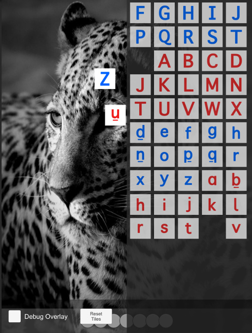

# Testing In-Editor
To play with the pieces in the editor, `TangibleManager` uses the `OnScreenController` to simulate pieces. These pieces are rendered on a separate layer named `TangibleLayer` which is automatically added to the layers of the project.

The simulated pieces are stored in virtual drawers. You can open / close drawers by pressing `X` (this is configurable on the `TangibleManager`). You can grab pieces and place them back inside drawers.

The `Reset Tiles` button will remove tiles from the play area and place them all back in the drawers.

The `Debug Overlay` toggle will enable the [`TangibleDebugOverlay`](#TangibleDebugOverlay).

To rotate pieces, press and hold your mouse button over a tile and hold `A` or `D` to rotate.

For coding pieces, pressing `W` `A` `S` `D` will set the direction arrow on pieces. Pressing `1` `2` `3` `4` `5` will set the quantifier attached. Press `SPACE` to send a 'play' button press.

  

# Debugging

Does nothing work on device and you can't figure out what's wrong?

Try filtering on the string `[OsmoSDK]` in the iOS logs and see if there is anything suspicious.

If you ever see an `[OsmoSDK]` log that says `internal error`, please let us know because that means we messed up something!

## Known Bugs

+ Coding Valley game renders tiles incorrectly when using on screen pieces (on all current builds)
