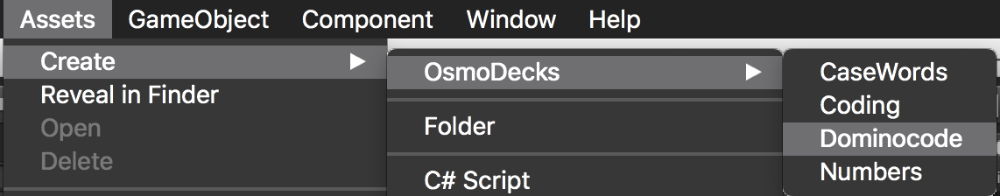

# Available Vision Support

The SDK supports several Osmo standard decks of physical pieces:
  - Words - upper and lower case letters, red and blue, shipped with the Words game.
  - Numbers - digits and dice faces, shipped with the Numbers game.
  - Coding - the various tiles shipped with Coding Awbie and Coding Jam (currently the character pieces with Coding Duo are not supported)
  - DominoCodes - printable barcodes, convenient to prototype new games [(printable link)](./dominocodes.pdf).

NOTE: We only support using a single deck at a time (so the SDK will not be able to detect both Words and Numbers tiles at the same time). You are able to change decks at runtime by calling `TangibleManager.Register`

## Customizing Decks

+ Currently, you cannot mix and match tiles from different sets.

If you want to change what tiles are detected (such as if you only care about BLUE letter tiles, or if you are using only certain Domino Codes) you can create a custom deck.

In Unity, in your menu bar select `Assets -> Create -> OsmoDecks`. You will see each type of base Deck that we support.

Select the deck type you want to start with.

### Add-Ons
You may attach any number of `ScriptableObject`s to a deck and have their `Init` and `Destroy` methods called when the Deck is created and destroyed.

For more on `ScriptableObject`, see the [Unity documentation](https://docs.unity3d.com/ScriptReference/ScriptableObject.html) and [tutorial](https://unity3d.com/learn/tutorials/modules/beginner/live-training-archive/scriptable-objects).

### Atlas
Texture that the editor will load for displaying tiles

## CaseWords

### Width Subdivision
Number of columns in the image

### Height Subdivision
Number of rows in the image

## Numbers

### Width Subdivision
Number of columns in the image

### Height Subdivision
Number of rows in the image

## Coding

### Coding Config Json
See `strawbies_config` as an example of what this config json looks like.

## DominoCode

### Default Image
The background used to display the Domino Codes in the editor

### Barcode Offset From Center
The offset from the reported center of the item compared to the center of the Domino Code

### Barcode Orientation Offset
The offset from the reported orientation compared to the actual orientation of the Domino Code

### Config Json
See `DominocodeConfig` as an example of what this config json looks like. You can restrict what IDs are recognized by the system to have a smaller set to worry about in the editor.
