# Quick-start Guide

## What you'll need
+ This guide (view the latest version [online](https://github.com/tangibleplay/sdk-readme))
+ Unity (tested against `2071.2f1`)
+ XCode (tested against 9.2)
+ MacOS (tested against Sierra 10.12)
+ An iPad (any iPad [Osmo supports](https://support.playosmo.com/hc/en-us/articles/115009542208-Which-iPad-models-is-Osmo-compatible-with-) - with iOS 8+)
+ Osmo Hardware ([Base+Reflector](https://www.playosmo.com/en/shopping/?overlay=osmo_game_system+osmo_base_ipad) and tiles you want to use from the set: [Words](https://www.playosmo.com/en/words/), [Numbers](https://www.playosmo.com/en/numbers/), [Coding Awbie](https://www.playosmo.com/en/coding/), [Coding Jam](https://www.playosmo.com/en/coding-jam/), [Domino Codes](https://github.com/tangibleplay/sdk-readme/blob/master/dominocodes.pdf))
+ The Osmo SDK (you should have received a download link)
+ An Osmo API Key (it should look like this `01234567-89AB-CDEF-0123-456789ABCDEF`)
	- If you don't have an API Key, contact us through [this application](https://docs.google.com/forms/d/1131Box1LDAskOu2tg5C0zak4G8Wp_WhpONpw73VH1aU/viewform?ts=5a0b256f)

## Getting started with a Hello World app
1. Download the `osmosdk-<date>.unitypackage` or `osmosdk-<date>.zip` file you were linked to.

2. Create a new Unity project (or create a new scene on an existing project you have set up)

3. Install the SDK using either `osmosdk-<date>.unitypackage` or `osmosdk-<date>.zip`
	+ It's important you put this in your top level `Assets` folder because the `Assets/Plugins/iOS` path will be pushed into the generated XCode project after the Unity build is complete.
	+ The SDK only needs what is in the `Plugins` folder.
	+ The `Examples` folder is there if you want to view our SDK Example scenes (see Examples section below). Feel free to delete it if you don't need it.
	+ The `Readme` folder contains this document you're reading right now. Feel free to delete it if you don't need it.

3. (a) If you are using `osmosdk-<date>.unitypackage`, open it from your file explorer and let it install.

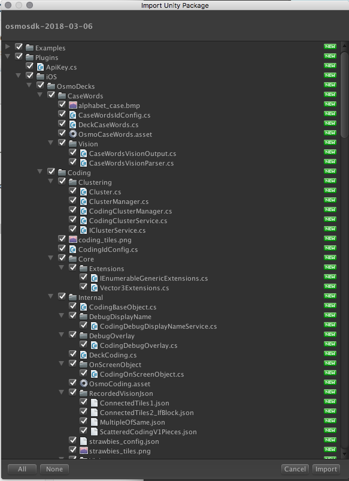

3. (b) If you are using the `osmosdk-<date>.zip`, extract it to a temporary location and then copy both the `Plugins` and `Examples` (optional) to your **top level** `Assets` Unity folder.

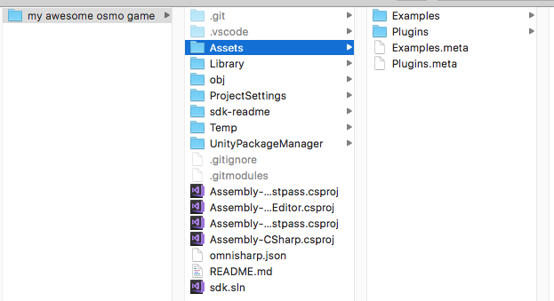

4. Create a new game object on your scene hierarchy. Name it "TangibleManager"
	+ Add the script `TangibleManager` to it

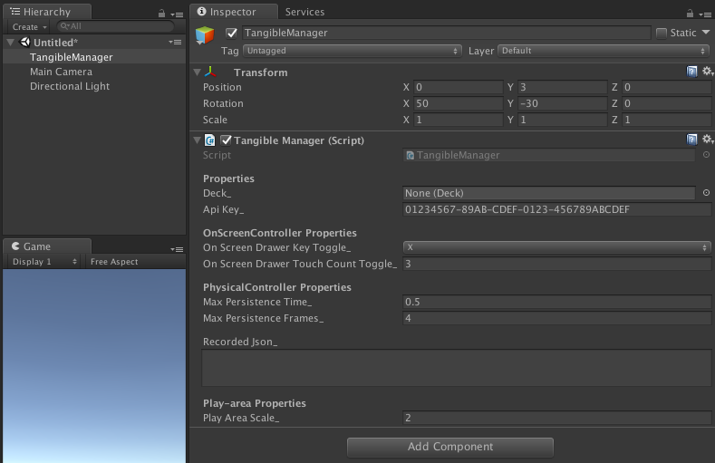

5. In the `TangibleManager` inspector, add a `Deck_` (these enable different tile sets such as Words, Numbers, or Coding)
	+ Find these in `Plugins/iOS/OsmoDecks` (or hit the `Assets` on the `Select Deck` window)
	+ For now, let's add `OsmoCaseWords`
	+ Paste in your API Key into the `apiKey_` field in the inspector (or you can edit it in `Assets/Plugins/ApiKey.cs`)

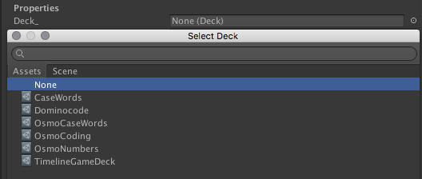

6. Create a new game object on your scene hierarchy. Name it "DumpTangibleData"

7. Create a new script and call it "DumpTangibleData" also, start editing it
	+ Add `using System.Linq;` to the usings
	+ Add the following to the `Update` function: `Tangible.SDK.TangibleManager.Instance.AliveObjects.ToList().ForEach(x => Debug.Log(x.ToString()));`
		- This is just a one-line example. This is probably not how you want to actually access the list of AliveObjects in your game

9. Press Play!

10. Hover your mouse over the right (or left) hand side of the game view and press `X`
	+ Each side of the screen will bring up a different half of the tiles available in the current deck.

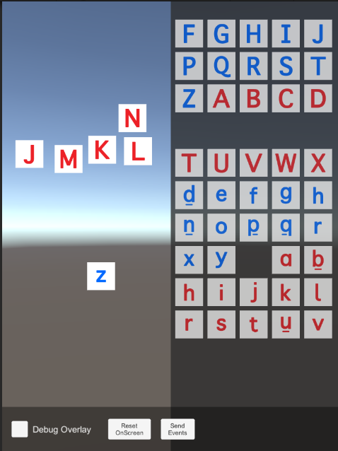

11. Drag a tile (what tiles you see here depends on the Deck you chose in step `5`) from this overlay to the center of the screen.

12. Watch your console log, observe the dumped out debug information

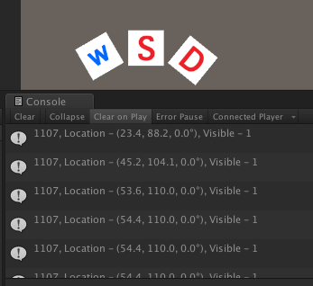

13. Congratulations! You've made your first Osmo App (=


## Getting your app on an iPad

1. Change your Unity build target to iOS: `File -> Build Settings -> iOS`

2. Create the XCode project: `File -> Build Settings -> Build` (we generally put them in a `builds` folder inside the unity project which you can then `.gitignore`)

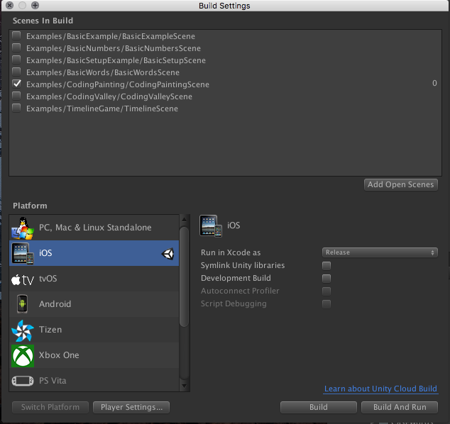

3. Wait for the build to complete and open up the generated XCode project
	+ You can also choose `Build & Run` instead of `Build`, but we've found that Unity sometimes has trouble opening up XCode this way on some machines.

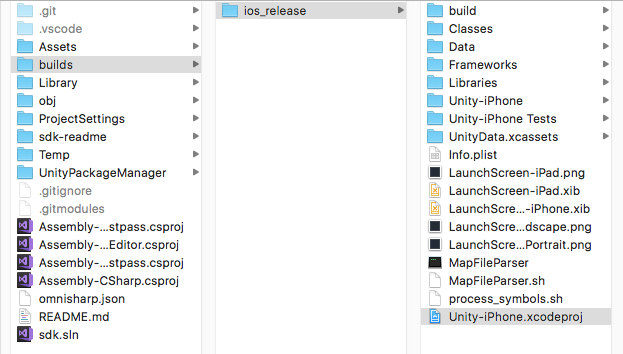

4. Attach an iPad to your computer via USB

5. Switch "Generic iOS Device" to your iPad

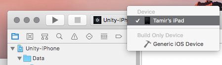

6. Hit play to build and install the app to your iPad

7. While in the app, use your Osmo Base/Mirror (you should be able to leave the lightning cable attached while it's in the base) to detect actual tiles.

You can also tap with 3 fingers to bring up the onscreen controller.


# Available Decks

The SDK supports several Osmo standard decks of physical pieces:
  - Words - upper and lower case letters, red and blue, shipped with the Words game.
  - Numbers - digits and dice faces, shipped with the Numbers game.
  - Coding - the various tiles shipped with Coding Awbie and Coding Jam (currently the character pieces with Coding Duo are not supported)
  - DominoCodes - printable barcodes, convenient to prototype new games [(printable link)](./dominocodes.pdf).

## Customizing Decks

+ Currently, you cannot mix and match tiles from different sets.

If you want to change what tiles are detected (such as if you only care about BLUE letter tiles, or if you are using only certain Domino Codes) you can create a custom deck.

In Unity, in your menu bar select `Assets -> Create -> OsmoDecks`. You will see each type of base Deck that we support.

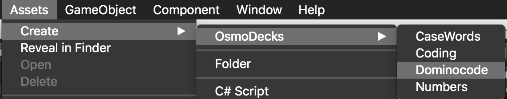

Select the deck type you want to start with.

### Add-Ons
You may attach any number of `ScriptableObject`s to a deck and have their `Init` and `Destroy` methods called when the Deck is created and destroyed.

For more on `ScriptableObject`, see the [Unity documentation](https://docs.unity3d.com/ScriptReference/ScriptableObject.html) and [tutorial](https://unity3d.com/learn/tutorials/modules/beginner/live-training-archive/scriptable-objects).


### Atlas
Texture that the editor will load for displaying tiles


## CaseWords
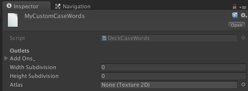

### Width Subdivision
Number of columns in the image

### Height Subdivision
Number of rows in the image

## Numbers
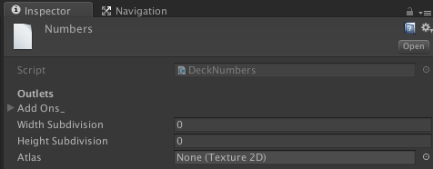

### Width Subdivision
Number of columns in the image

### Height Subdivision
Number of rows in the image

## Coding
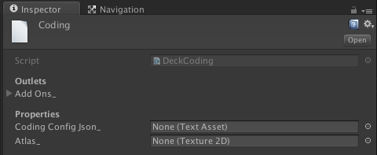

### Coding Config Json
See `strawbies_config` as an example of what this config json looks like.

## DominoCode
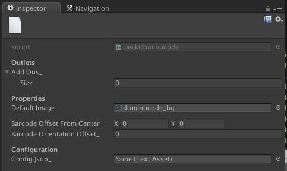

### Default Image
The background used to display the Domino Codes in the editor

### Barcode Offset From Center
The offset from the reported center of the item compared to the center of the Domino Code

### Barcode Orientation Offset
The offset from the reported orientation compared to the actual orientation of the Domino Code

### Config Json
See `DominocodeConfig` as an example of what this config json looks like. You can restrict what IDs are recognized by the system to have a smaller set to worry about in the editor.


# Testing In-Editor
To play with the pieces in the editor, `TangibleManager` uses the `OnScreenController` to simulate pieces. These pieces are rendered on a separate layer named `TangibleLayer` which is automatically added to the layers of the project.

The simulated pieces are stored in virtual drawers. You can open / close drawers by pressing `X` (this is configurable on the `TangibleManager`). You can grab pieces and place them back inside drawers.

The `Reset Tiles` button will remove tiles from the play area and place them all back in the drawers.

The `Debug Overlay` toggle will enable the [`TangibleDebugOverlay`](#TangibleDebugOverlay).

To rotate pieces, press and hold your mouse button over a tile and hold `A` or `D` to rotate.

For coding pieces, pressing `W` `A` `S` `D` will set the direction arrow on pieces. Pressing `1` `2` `3` `4` `5` will set the quantifier attached. Press `SPACE` to send a 'play' button press.

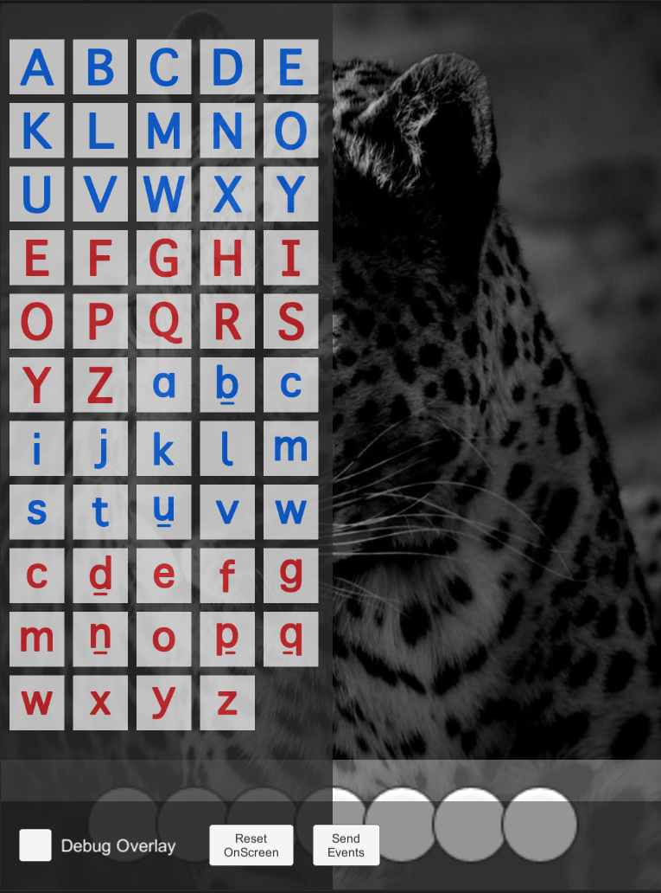


# Examples

We provide a set of example scenes which demonstrate various ways to use the SDK. These range from simply dumping out raw data to a small puzzle game using Coding tiles. Explore, mangle, and poke at these to your heart's content.

## 1. Basic Example
`Examples/BasicExample/BasicExampleScene.unity`

A simple example of dumping out values seen by the computer vision to screen. Swap out the Deck of the `TangibleManager` on the scene to use different types of tiles.

In our `Update()` call of `Tangible.SDKExamples.BasicExample.Game` you will see we use the current `AliveObjects` list pulled from the singleton instance of `TangibleManager`.

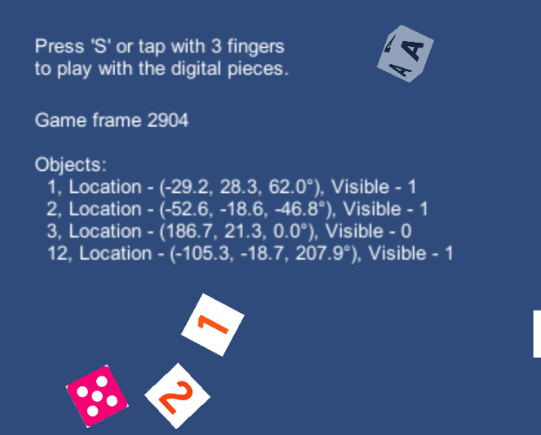


## 2. Basic Setup Example
`Examples/BasicNumbers/BasicNumbersScene.unity`

An example of how to use the setup configuration values in order to instruct the user on how to properly set up the Osmo hardware.

If you are testing this in the editor, look at the `VisionSetup` object in the scene. You can modify which flags are sent (see the [`VisionSetup`](#visionsetup) section for more).

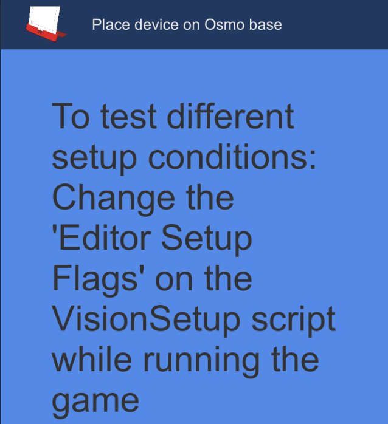


## 3. Basic Numbers
`Examples/BasicSetupExample/BasicSetupScene.unity`

In this example, we subscribe to the events `OnObjectEnter` and `OnObjectExit` from the `TangibleManager`. In the case of subtraction, we also register for the event `OnLocationChanged` because we need to order by X position when tiles move (even if no new tiles enter or exit the play area)

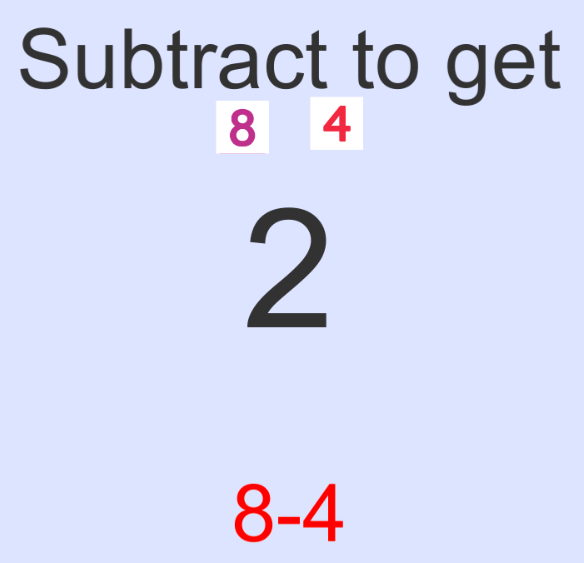

## 4. Basic Words
`Examples/BasicWords/BasicWordsScene.unity`

An example of a game which only registers with `OnObjectEnter`. Once a letter has been detected, the game treats it as guessed. `OnObjectExit` is ignored because letters cannot be unguessed.


## 5. Timeline Game
`Examples/TimelineGame/TimelineScene.unity`

An example game using domino codes. It uses a custom deck (which ignores domino code values that are not used by the game). To play this on device, print out a set of domino codes from `dominocodes.pdf` in the `Readme` directory of the SDK.

In order to make your own custom decks, see the [Customizing Deck](#customizing-decks) section.

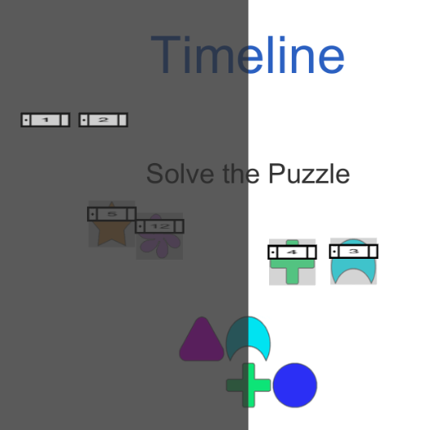

## 6. Coding Painting
`Examples/CodingPainting/CodingPaintingScene.unity`

See the [Testing In-Editor](#testing-in-editor) section for how to play in-editor with Coding tiles.

The game of life, using coding tiles to seed different species on the board.

This game uses Coding tiles, and the `ClusterManager`. It uses the most simple decision of what cluster to use by always choosing the largest one.

The `ClusterManager` subscribes to the `OnUpdatedTangibleObjects` event which fires an event every time the computer vision returns with a new set of data. The rate at which this happens is not the same as your Unity update rate. It’s generally 10-20 times per second on a newer iPad.

See `CodingClusterService` for how the game decides what is in a cluster and what is not.

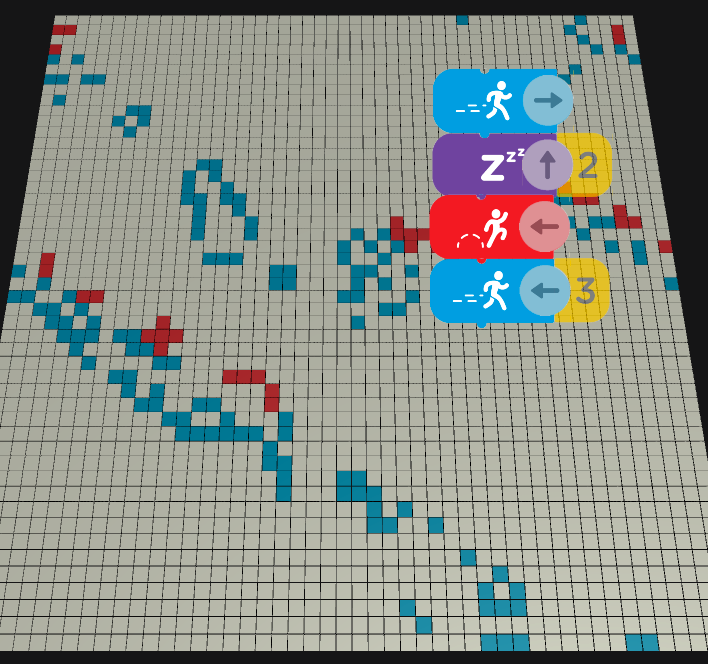


## 7. Coding Valley
`Examples/CodingValley/CodingValleyScene.unity`

See the [Testing In-Editor](#testing-in-editor) section for how to play in-editor with Coding tiles.

An example of a more complete small puzzle game using the Coding tiles.

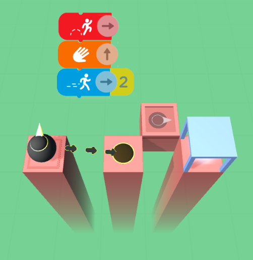


## 8. Example Selector
`Examples/ExampleSelector/ExampleSelectorScene.unity`

Use this scene if you want to select between the above example scenes. We do not currently support swapping decks at runtime (please let us know if you would like this feature), so you will have to close the app to select a new scene.

In order to have this work, you will need to add all of the scenes in your `File -> Build Settings -> Scenes in Build` list.

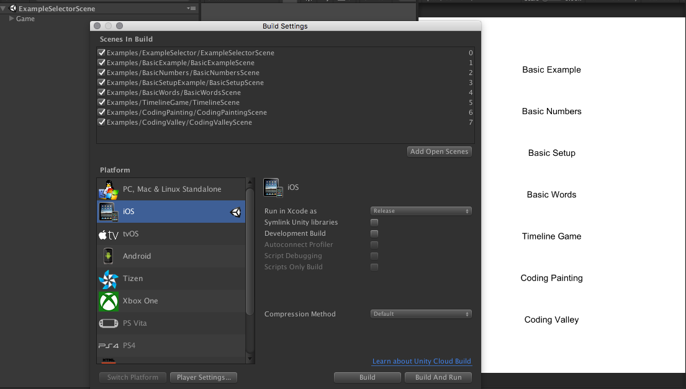


# API

## API Key

You should have received a private API Key along with your Osmo SDK download. This uniquely identifies you and should not be shared publicly.

It should look like this: `01234567-89AB-CDEF-0123-456789ABCDEF`

If you don't have an API Key, contact us through [this application](https://docs.google.com/forms/d/1131Box1LDAskOu2tg5C0zak4G8Wp_WhpONpw73VH1aU/viewform?ts=5a0b256f)

You have two options on how to enter this API Key in your Unity project.

You can paste it directly into `Assets/Plugins/ApiKey.cs`
```csharp
namespace Tangible.SDK.Vision {
	public static class API {
		public static string Key = "00000000-0000-0000-0000-000000000000";
	}
}
```

You can set it in the inspector in your `TangibleManager`. Values set in the inspector will take precedence over values set in `ApiKey.cs`.

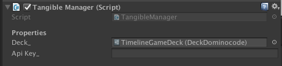


## TangibleManager
- [TangibleManager.AliveObjects](#aliveobjects)
- [TangibleManager.OnObjectEnter](#onobjectenter)
- [TangibleManager.OnObjectExit](#onobjectexit)
- [TangibleManager.OnUpdatedTangibleObjects](#onupdatedtangibleobjects)
- [TangibleManager.Mute](#mute)

`TangibleManager` is the main interface to the OsmoSDK. You can access all the `TangibleObject`s here which represent the physical pieces.

The class implements multiple ways of generating the input, primarily:
  - If the game is running in the Unity Editor, it will use the `OnScreenController` which simulates pieces.
  - Otherwise, it will use the `PhysicalController` which relies on the `VisionFramework` and the camera input.

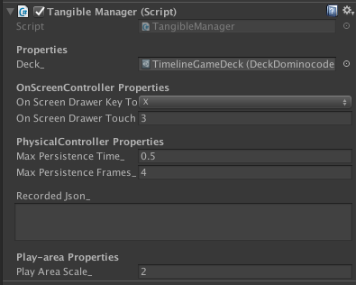

### AliveObjects
```csharp
public IEnumerable<TangibleObject> AliveObjects { get; }
```

All `TangibleObject`s that are `Alive`. This is useful if you are starting up some level and want to know if vision already has some recognized pieces.


### OnObjectEnter
```csharp
public event Action<TangibleObject> OnObjectEnter;
```

Invoked whenever a `TangibleObject` becomes `Alive`. This is the case when the piece (whether simulated or not) is recognized from vision.

### OnObjectExit
```csharp
public event Action<TangibleObject> OnObjectExit;
```

Invoked whenever a `TangibleObject` becomes not `Alive`. This happens when the piece is no longer recognized by vision and after a certain amount of time / frames have passed. You can modify how long this takes by changing the values on your `TangibleManager` MonoBehaviour on your scene.

The `TangibleObject` persists because the piece can disappear from vision for a couple frames due to any number of factors including obstruction from hands, etc.

### OnUpdatedTangibleObjects
```csharp
public event Action OnUpdatedTangibleObjects;
```

Invoked whenever the `VisionFramework` has processed and returned new data. The `VisionFramework` does NOT run in lockstep with Unity, it is completely asynchronous.

It will generally run at approximately 10-20 frames per second, but on older devices it may be even slower (especially if you are doing a lot of CPU processing in Unity).


### Mute
```csharp
public void Mute(bool mute);
```

Muting the `VisionFramework` will disable all computer vision processing until you unmute. This is useful if you want to save CPU resources when you don't need any data from the `VisionFramework` (such as if you're on a home screen or a settings screen).


## TangibleObject
- [TangibleObject.Id](#id)
- [TangibleObject.UniqueId](#uniqueid)
- [TangibleObject.Alive](#alive)
- [TangibleObject.Visible](#visible)
- [TangibleObject.Location](#location)

`TangibleObject` is the C# class that represents a physical piece in the Deck.

### Id
```csharp
public int Id;
```

`Id` is mapped to a piece in the Deck (this is non-unique since there can be multiples of the same piece - i.e. walking block in Coding)

### UniqueId
```csharp
public readonly int UniqueId;
```

Given that there can be multiple of the same pieces per deck, `TangibleObject`s have a `UniqueId` which is used to map the vision output to the last closest unique physical piece.

This is a best effort calculation. You will never see two objects with the same `UniqueId`, but you may see see two `UniqueId`s where you would have thought there should have been one (generally worse on older iPads with worse cameras where we cannot keep track of tiles as well).

### Alive
```csharp
public bool Alive { get; }
```

`Alive` means that this piece is in the play area. This includes persisted pieces that were not in the last vision frame.

### Visible
```csharp
public bool Visible { get; }
```

`Visible` means that this piece is in the play area. This **does not** includes persisted pieces that were not in the last vision frame. `Visible` values will flicker on/off as the vision algorithms work with imperfect camera input.

### Location
```csharp
public Location Location { get; }
```

`Location` contains all the data of the piece's current position and orientation.

```csharp
public class Location {
  public float X { get; }
  public float Y { get; }

  // angle in degrees
  public float Orientation { get; }
}
```

## TangibleDebugOverlay
- [TangibleDebugOverlay.Show](#show)
- [TangibleDebugOverlay.Hide](#hide)

To debug what the vision is seeing on device, we have provided a class called `TangibleDebugOverlay` which has two methods `Show()` and `Hide()`. You can show the debug overlay at anytime to display ghost tiles on the screen matching the `TangibleObject`s active in `TangibleManager`.

You can toggle the TangibleDebugOverlay through the editor panel that appears when you press 'S'. Use the "Debug Overlay" checkmark at the bottom. You'll see the raw id values overlayed on top of the tiles you are manipulating.


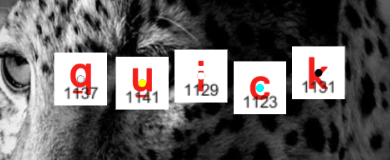

### Show
```csharp
public static void Show();
```

`Show` starts up DebugOverlay objects which will render ghost pieces on the screen that correspond to `TangibleObject`s in `TangibleManager`.

### Hide
```csharp
public static void Hide();
```

Hides the DebugOverlay objects.

## VisionSetup
- [VisionSetup.SetState](#setstate)
- [VisionSetup.GetSetupFlags](#getsetupflags)

Using computer vision, we can detect if the device is setup properly and prompt for certain actions if needed. To do this, we use the `VisionSetup` script. You can access it, if it exists in the scene, by calling `VisionSetup.Instance`.

We have provided basic UI for dealing with setup flags that require user action. To use it, add the `BuiltInSetupUI` script to your scene.

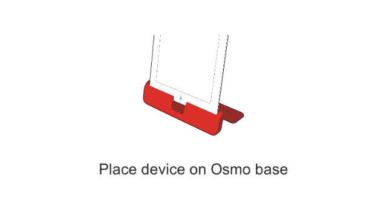


To customize the visuals, look at these prefabs (Modify if you are using fullscreen setup or not in the `SetupUI` child of `VisionSetup`)
+ `BuiltInSetupFlagConstant` - Points to images used by the prefabs below
+ `BuiltInSetupUIDropdown` - Prefab used for the non-blocking setup dropdown
+ `BuiltInSetupUIFullScreen` - Prefab used for the blocking full screen setup

### SetState
```csharp
public void SetState(VisionSetupState state);
```

For performance reasons, you can set the state to be Inactive or Active. Inactive means that vision setup is not checking for new data. Active means that vision setup will check for new data every vision frame.

```csharp
public enum VisionSetupState {
	Inactive,
	Active,
}
```

### GetSetupFlags
```csharp
public ReadOnlyCollection<SetupFlag> GetSetupFlags();
```

Get all the flags that vision is reporting. You can parse this in order to display to the user how you want them to correct the incorrect base/mirror setup.

```csharp
public enum SetupFlag {       // an integer bit mask with these bit values
	Run = 0,                  // 1
	Perfect = 1,              // 2
	BadOrientation = 2,       // 4
	MirrorUncentered = 4,     // 16
	MirrorMoveLeft = 5,       // 32
	MirrorMoveRight = 6,      // 64
	NoMirrorDetected = 7,     // 128
	PushMirrorDown = 8,       // 256
	NoMotionData = 12,        // 4,096
	OsmoBoardDetected = 16,   // 65,536
	Error = 31,               // 2,147,483,648
}
```

If you are testing in editor, you can control the flags sent on your `VisionSetup` object.

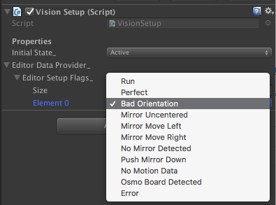


# Debugging

Does nothing work on device and you can't figure out what's wrong?

Try filtering on the string `[OsmoSDK]` in the iOS logs and see if there is anything suspicious.

If you ever see an `[OsmoSDK]` log that says `internal error`, please let us know because that means we messed up something!


# Future Plans
We need your help! 

+ What would you like to see change, added, removed from the SDK?
+ What expectations did we not meet?
+ What was confusing?
+ What didn't work?
+ What did work?

# Legal
The latest [SDK License Agreement](https://docs.google.com/document/d/1YK82HsDxKN9U_w3t507ON6N_rN6XuUH8af9n4wB2z5A).

If you have not read and signed the license agreement, please [go here](https://docs.google.com/forms/d/1131Box1LDAskOu2tg5C0zak4G8Wp_WhpONpw73VH1aU/viewform?ts=5a0b256f) so you can get an API Key.

## License Summary

+ Read the full license, it is not that long. This summary is not a replacement for reading the full license.
+ Do not share *Confidential Information* on the Osmo SDK publicly or to other parties that have not signed the SDK License.
+ This license does *NOT* allow you to publish a commercial or free application using the Osmo SDK. If you wish to do this, please contact us.
+ Assets (such as images, sounds, animations, etc) are NOT licensed for any redistribution.
+ We provide the Osmo SDK 'As Is' with no guarantees.

For any other questions, contact sdk@playosmo.com or send a message on the TangiblePlay SDK slack channel you should have been invited to.
