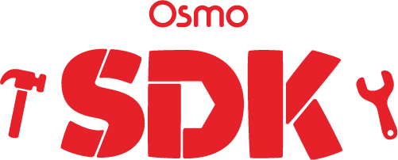
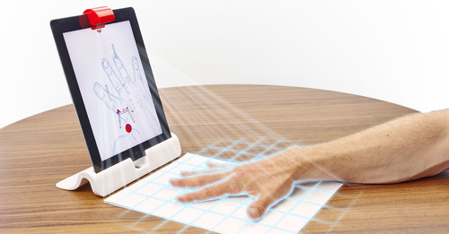

## What is Osmo?

Osmo is an award winning game system that changes the way kids play games on the iPad.  We’re currently in open beta with our SDK and are looking for game developers like you who share our love of making games for kids! If you’re interested, please send an email at sdk@tangibleplay.com for more information.

Visit www.playosmo.com to see for yourself. We have plenty of videos and more detailed explanations of all of our games.

## How can I get it?

Fill out this short [application form](https://docs.google.com/forms/d/1131Box1LDAskOu2tg5C0zak4G8Wp_WhpONpw73VH1aU/viewform?ts=5a0b256f). We'll get back to you as quickly as we can.

## How does it work?

Magic! Also, a lot of awesome computer vision (=

The Osmo base holds your iPad up vertically. The red plastic thing (we call it the red reflector) you put on top of the iPad has a mirror in it. That mirror reflects the front facing camera down towards the table so that we can *see* what the player is doing in front of the iPad (drawing, throwing tiles down, or putting together coding blocks in order).

## What is the Osmo SDK Beta?

Our SDK lets you use our kid proven and teacher tested tangible game pieces to make your own games or applicaitons. It's our way of letting developers work with our hardware and computer vision software in order to make their own games.

You can prototype, you can build a new game with our tiles, you can build something awesome we've never even dreamed of. 

If you want to release your game to the public, let us know and we will work with you to make a licensing agreement that works for both of us.

We are excited to see what you make!

## Who was Osmo designed for?

Osmo apps range for ages 5–12, but people of all ages enjoy it.

We love to make games for kids, but we're completely open to other types of games and tools that you'd like to make with the Osmo SDK!

## What tiles does the SDK support?

Currently, the SDK supported the following tilesets: Words, Numbers, Coding, Domino Codes (printable codes similar to QR codes).

We use domino codes internally for prototyping when we want to detect some hardware that we haven't developed the computer vision for yet. Just print out the codes and stick them on top of whatever the new hardware pieces are. Play around with different scales of printing the codes depending on how near/far/high your pieces are going to be.

## I have the SDK now, what do I do?

+ Make sure you understand the [License Agreement](#Legal)
+ Read the [Quick-Start Guide](./README-QuickStart.md)
+ Learn about [Testing In-Editor](./README-TestingInEditor.md)
+ Go over our [Example Projects](./README-Examples.md)
+ Review the full [API Docs](./README-API.md)
+ If you're having troubles checkout the [Debugging](./README-TestingInEditor.md) section
+ Make your game! Give us some [feedback](#Future-Plans)

  

# Legal
The latest [SDK License Agreement](https://docs.google.com/document/d/1YK82HsDxKN9U_w3t507ON6N_rN6XuUH8af9n4wB2z5A).

If you have not read and signed the license agreement, please [go here](https://docs.google.com/forms/d/1131Box1LDAskOu2tg5C0zak4G8Wp_WhpONpw73VH1aU/viewform?ts=5a0b256f) so you can get an API Key.

## License Summary

+ Read the full license, it is not that long.
	- This summary is not a replacement for reading the full license.
+ Do not share *Confidential Information* on the Osmo SDK publicly or to other parties that have not signed the SDK License.
+ This license does *NOT* allow you to publish a commercial or free application using the Osmo SDK. If you wish to do this, please contact us.
+ Assets (such as images, sounds, animations, etc) are NOT licensed for any redistribution.
+ We provide the Osmo SDK '*As Is*' with no guarantees.

For any other questions, contact sdk@playosmo.com or better yet send a message on the Osmo SDK slack channel you should have been invited to.

  

# Future Plans
We need your help! 

+ What would you like to see change, added, removed from the SDK?
+ What expectations did we not meet?
+ What was confusing?
+ What didn't work?
+ What did work?

Get in touch with us (through the slack channel or sdk@playosmo.com).